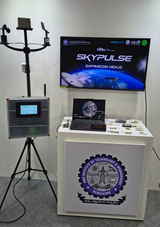
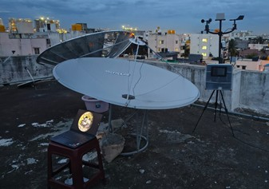

# SkyPulse – Centre for RF, Remote Sensing & Data Analytics

> An IEEE EPICS-funded multidisciplinary research centre and distributed atmospheric sensing network at BMSIT&M, targeting hyperlocal urban climate characterisation, satellite signal reception, and RF propagation studies across the Bengaluru region.


---

## 🌍 Overview

SkyPulse is a research centre established in October 2025 at BMS Institute of Technology & Management. It operates at the intersection of **radio-frequency engineering**, **satellite-based remote sensing**, and **data-driven atmospheric analysis**. The centre takes an end-to-end systems approach — from hardware prototyping and signal acquisition to data processing and analytical modelling.

The centre was funded through the **IEEE EPICS (Engineering Projects in Community Service)** programme, sanctioned at **₹7,25,000/-** in May 2025.

---


## 🎯 Research Focus Areas

1. **Urban Microclimate Nowcasting** — Development of hyperlocal weather prediction models for the Bengaluru region (~45 km radius), combining ground sensor data with satellite imagery.

2. **Satellite Signal Reception & Processing** — X-band and L-band satellite signal acquisition for meteorological and remote sensing applications (e.g., INSAT, NOAA, Meteor-M).

3. **RF Propagation Studies** — Experimental characterisation of atmospheric attenuation, signal variability, and propagation effects due to weather phenomena.

4. **Embedded RF Subsystems** — Design, prototyping, and validation of low-power RF and embedded sensing nodes for the distributed sensor network.

5. **Urban Climate Datasets & Early Warning** — Generation of validated longitudinal environmental datasets and frameworks for flood risk, urban heat island analysis, and climate-resilient planning.

---

## 🔧 Centre Infrastructure

| Equipment | Purpose |
|---|---|
| 1.8 m L-band Parabolic Dish Antenna + Antenna Tracker | Geostationary weather satellite reception (INSAT, etc.) |
| Software-Defined Radio (SDR) Receivers | Signal acquisition and processing for X-band and L-band |
| Vector Network Analyser (VNA) | RF characterisation of antennas and components |
| LoRaWAN Development Kits | Low-power sensor network node testing |
| RF Soldering & Prototyping Workstation | SMD/THT assembly for antenna and RF board fabrication |
| 3D Printer (256 mm³ build volume) | Rapid fabrication of PCB enclosures, antenna mounts, brackets |
| GPU Workstation + NAS *(expected 2026)* | Machine learning model training on climate datasets |

---

## 🌐 LoRaWAN Sensor Network

The distributed sensing network consists of LoRaWAN-enabled weather station nodes deployed across the Bengaluru urban area. Each node measures:

- Temperature, Humidity (atmospheric)
- Particulate Matter (PM1.0, PM2.5, PM10)
- Barometric Pressure
- Wind speed/direction *(planned)*

Data is aggregated at a central gateway and pushed to a cloud dashboard for real-time visualisation and modelling.

**Showcased at:** India Mobile Congress (IMC) 2025
<p align="center">
  
  <br>
   Environmental sensing node for hyperlocal atmospheric monitoring applications.
</p>
---

## 🛰️ Satellite Reception Pipeline

```
[Geostationary Satellite (L-band)]
            ↓
[1.8m Parabolic Dish + LNB]
            ↓
[SDR Receiver (RTL-SDR / Airspy)]
            ↓
[GNU Radio / SatDump signal processing]
            ↓
[Decoded meteorological imagery & data]
            ↓
[Nowcasting model input]
```
<p align="center">
  
  <br>
   L-band satellite reception setup consisting of parabolic dish antenna and SDR-based signal acquisition hardware used for meteorological satellite reception.
</p>
---

## 🤝 Collaborations

| Partner | Contribution |
|---|---|
| IEEE EPICS in IEEE | Project funding (₹7,25,000) |
| IEEE Antennas & Propagation Society (AP-S) | Technical mentorship for antenna design |
| IEEE Communications Society (ComSoc) | Capacity building for RF and communication subsystems |
| Bradley University, USA | Expertise in anechoic chamber design and EM measurement |
| Green Circle NGO, Bengaluru | Community outreach and ground-level engagement |

---

## 📋 Project Outcomes (Planned)

- ✅ Functional L-band and X-band satellite ground station
- ✅ Hyperlocal environmental dataset for Bengaluru urban area
- 🔄 Short-term weather nowcasting models (cloud movement, rainfall prediction)
- 🔄 RF propagation and atmospheric attenuation studies
- 🔄 Urban heat island and flood risk analysis
- 🔄 Student research publications and hands-on training programme

---

## 👥 Team & Investigators

| Name | Role |
|---|---|
| Dr. Anitha V R | Principal Investigator |
| Nitish K S | Co-Investigator |
| Tarun Patil | Co-Investigator |
| Sri Srujan Hari T | Hardware Lead / Prototyping |

**Institution:** BMS Institute of Technology & Management, Yelahanka, Bengaluru – 560119

---

## 📅 Timeline

| Milestone | Date |
|---|---|
| Centre established | October 2025 |
| EPICS proposal submitted | May 1, 2025 |
| EPICS funding sanctioned (₹7,25,000) | May 2025 |
| LoRaWAN node showcased at IMC 2025 | 2025 |
| GPU Workstation + NAS facility (expected) | 2026 |

---

## 📬 Contact

For research collaborations or enquiries:
**Email:** thammineedisrujanhari@gmail.com
**Institution:** BMSIT&M, Yelahanka, Bengaluru
